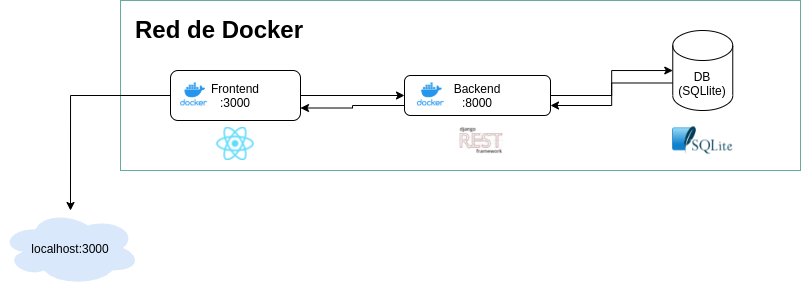

# todo-app-django
Aplicación Web para llevar la lista de pendientes 


## Objetivo

La aplicación se crea para poder trabajar los conceptos relacionados con la integración continua, para la asignatura con el mismo nombre en el pregrado de Ingeniería de Software del Politécnico Grancolombiano.

## Arquitectura de la aplicación (Alto nivel)

Al usar docker-compose, la herramienta crea una red privada que permite la comunicación entre los servicios que convivan dentro de la misma.

En este caso tenemos dos: 

El servicio frontend (React.js), el cual recibe las instrucciones por parte del usuario final y adicionalmente se encarga de mostrar una representación visual de la aplicación. (Este servicio se expone a través del puerto 3000)

El servicio de backend (Python3 - Django Rest Framework), el cual se encarga de toda la lógica de la aplicación, conectarse a la base de datos y guardar datos en dicha base, así como retornar la información que se almacena en la base de datos a través de servicios RESTFUL. (Este servicio se expone a través del puerto 8000)

> En esta versión de la aplicación estamos utilizando SQLlite como base de datos, ya que es un prototipo, no se recomienda su uso en sistemas productivos.



## Comandos utilitarios

### Comandos de Makefile

```bash
make build_service # Construye el servicio usando la información del docker-compose (Se requiere docker y docker-compose instalado para esto)
```

### Comandos de compose

```bash
docker-compose up --build # Levanta el servicio de compose, forzando el build de los contenedores de docker relacionados en el

docker-compose run --rm backend python manage.py makemigrations # Crear las migraciones de la base de datos
docker-compose run --rm backend python manage.py migrate # Aplicar las migraciones en la base de datos
docker-compose run --rm backend python manage.py createsuperuser # Crear super usuario para django admin
```

## Creación de los contenedores

### Contenedor para servicio Frontend

```Docker
# Se obtiene capa de sistema base desde el dockerhub, la versión alpine es una versión ligera.
FROM node:lts-alpine

# Se declara el directorio de trabajo
WORKDIR /app/

# Instalación de dependencias
# COPY package.json yarn.lock /app/

# RUN npm install

# Se copia el Código del servicio frontend al contexto de Docker
COPY . /app/

# Se expone el puerto 3000 a través del cual podremos consumir el servicio
EXPOSE 3000

# Comando para inicialización del servicio
# CMD npm start
```
